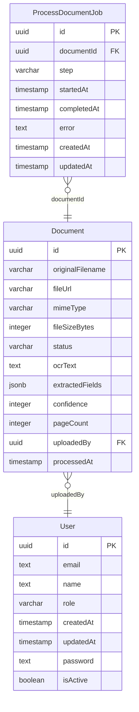
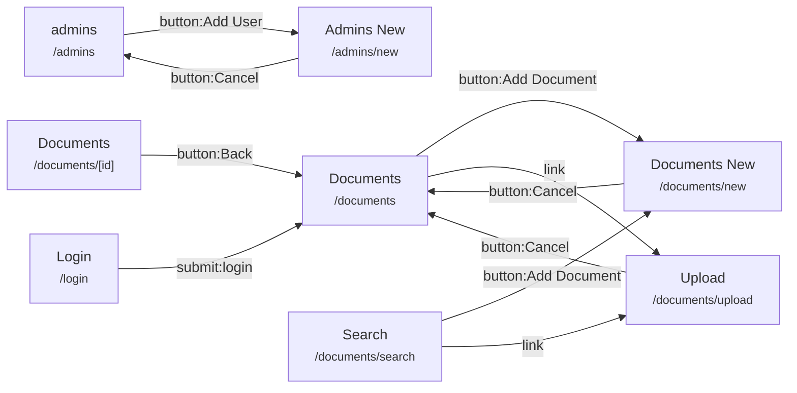
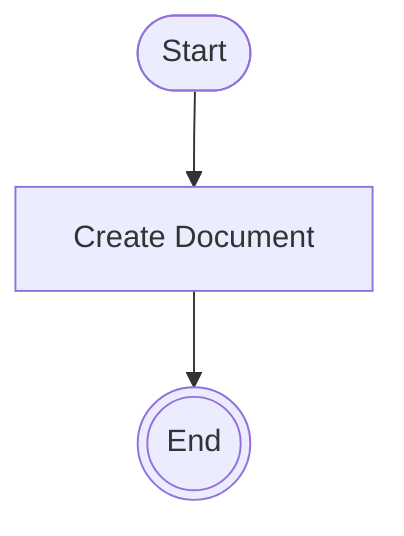
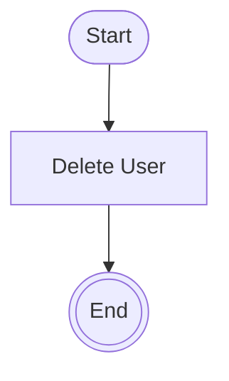
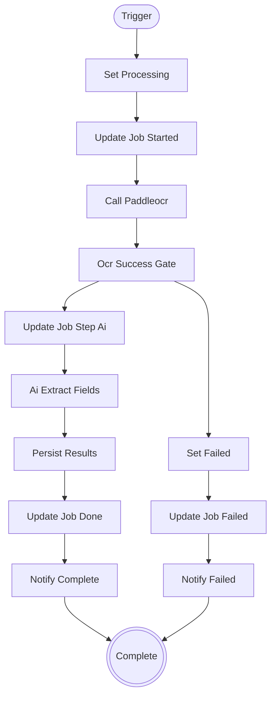
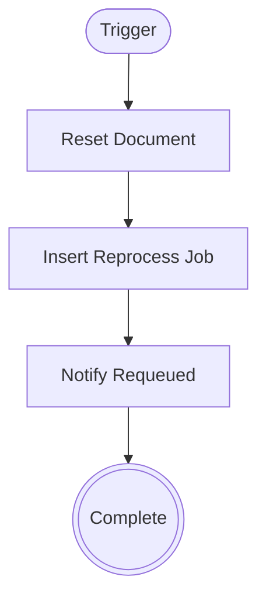
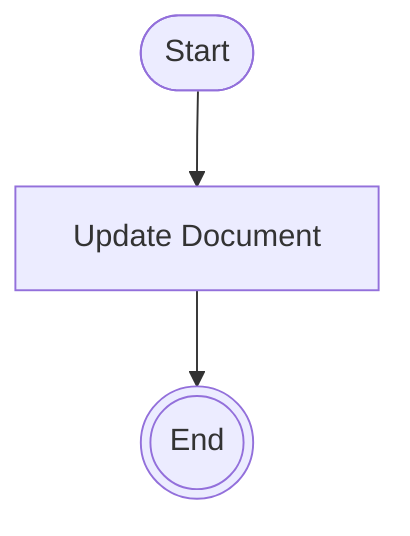
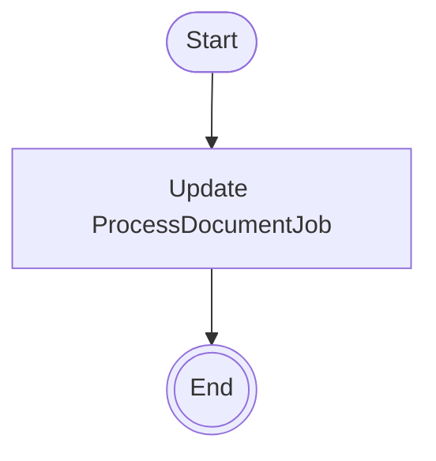
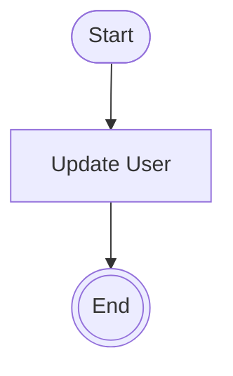
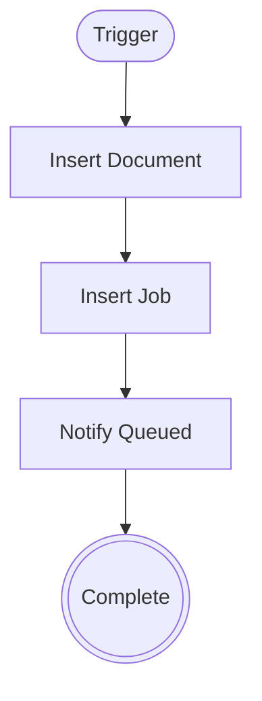

# Document Intelligence

_Last built: 2026-08-15 16:54:31 UTC · Blueprint version 1 · Written by: generation · Log: 1 entry_

> Internal admin tool for uploading paper/PDF records, running OCR via PaddleOCR sidecar and AI field extraction, and searching the resulting structured and full-text content.

## Architecture
- Frontend: Next.js ^15.1.0 (App Router) + React ^19.0.0
- Backend: Next.js API routes + Drizzle ORM + PostgreSQL
- Auth: NextAuth
- Runtime: @tentoroforge/renderer

## Data Model

### Entities

| Entity | Columns | FKs | Purpose |
|---|---|---|---|
| **Document** | id, originalFilename, fileUrl, mimeType, fileSizeBytes, status, ocrText, extractedFields (+8 more) | uploadedBy→user | — |
| **ProcessDocumentJob** | id, documentId, step, startedAt, completedAt, error, createdAt, updatedAt | documentId→document | — |
| **User** | id, email, name, role, createdAt, updatedAt, password, isActive | — | — |

## Actors & Roles

- **admin**

## Pages

| Route | Type | Entity | Purpose / Title |
|---|---|---|---|
| `/documents` | — | Document | Documents |
| `/documents/upload` | — | — | Upload |
| `/documents/[id]` | — | Document | Documents |
| `/documents/search` | — | Document | Search |
| `/` | — | Document | Dashboard |
| `/login` | — | — | Login |
| `/admins` | — | User | admins |
| `/admins/new` | — | — | Admins New |
| `/documents/new` | — | — | Documents New |
| `/home/new` | — | — | Home New |
| `/Document/:id/edit` | — | Document | — |
| `/Document/new` | — | — | — |
| `/admins/:id/edit` | — | User | — |
| `/documents/:id/edit` | — | Document | — |
| `/home/:id/edit` | — | Document | — |
| `/shell` | — | — | App Shell |

### Page Details

#### `/Document/:id/edit` — Document-new
- Data sources:
  - `document` — get Document
- Workflows dispatched: UpdateDocument

#### `/Document/new` — Document-new
- Workflows dispatched: CreateDocument

#### `/admins/:id/edit` — admins/[id]/edit.json
- Data sources:
  - `user` — get User
- Workflows dispatched: UpdateUser

#### `/admins/new` — admins-new
- Workflows dispatched: CreateUser

#### `/admins` — admins-page
- Data sources:
  - `admins` — list User

#### `/documents/:id/edit` — documents/[id]/edit.json
- Data sources:
  - `document` — get Document
- Workflows dispatched: UpdateDocument

#### `/documents/[id]` — document-detail-page
- Data sources:
  - `document` — get Document

#### `/documents/new` — documents-new
- Workflows dispatched: CreateDocument

#### `/documents/search` — documents/search
- Data sources:
  - `documents_search_extracted` — list Document
  - `documents_search_needs_review` — list Document
  - `documents_search_extraction_failed` — list Document

#### `/documents/upload` — documents/upload
- Components: data

#### `/documents` — documents-list-page
- Data sources:
  - `documents` — list Document

#### `/home/:id/edit` — home/[id]/edit.json
- Data sources:
  - `document` — get Document
- Workflows dispatched: UpdateDocument

#### `/home/new` — home/new.json
- Workflows dispatched: CreateDocument

#### `/` — home
- Data sources:
  - `documentStat` — aggregate Document
  - `documentStat2` — aggregate Document
  - `documentStat3` — aggregate Document
  - `documentStat4` — aggregate Document
  - `documentByStatus` — series Document
  - `documentByCreatedAt` — series Document

#### `/` — dashboard-page
- Data sources:
  - `totalDocuments` — aggregate Document
  - `completeDocuments` — aggregate Document
  - `failedDocuments` — aggregate Document
  - `recentDocuments` — list Document
  - `Document_recent` — list Document

#### `/login` — login
- Components: email, text

#### `/shell` — App Shell

## Navigation

## Workflows

| Workflow | Trigger | Inputs | Steps |
|---|---|---|---|
| **CreateDocument** | manual | originalFilename, fileUrl, mimeType, fileSizeBytes, status, ocrText, extractedFields, confidence | 3 |
| **CreateProcessDocumentJob** | manual | documentId, step, startedAt, completedAt, error | 3 |
| **CreateUser** | manual | email, password, name, role | 3 |
| **DeleteDocument** | manual | id | 3 |
| **DeleteProcessDocumentJob** | manual | id | 3 |
| **DeleteUser** | manual | id | 3 |
| **ProcessDocumentWorkflow** | api_event | — | 14 |
| **ReprocessDocumentWorkflow** | api_event | — | 5 |
| **UpdateDocument** | manual | id, originalFilename, fileUrl, mimeType, fileSizeBytes, status, ocrText, extractedFields | 3 |
| **UpdateProcessDocumentJob** | manual | id, documentId, step, startedAt, completedAt, error | 3 |
| **UpdateUser** | manual | id, email, password, name, role | 3 |
| **UploadDocumentsWorkflow** | api_event | — | 5 |

### CreateDocument

Create a Document record.

### CreateProcessDocumentJob

Create a ProcessDocumentJob record.

### CreateUser

Create a User record.

### DeleteDocument

Delete a Document record.

### DeleteProcessDocumentJob

Delete a ProcessDocumentJob record.

### DeleteUser

Delete a User record.

### ProcessDocumentWorkflow

Core async pipeline: marks document processing, calls PaddleOCR sidecar, runs AI extraction, persists results. Sets status=failed on any error.

### ReprocessDocumentWorkflow

Resets a failed or complete document back to queued status and dispatches a new ProcessDocumentJob.

### UpdateDocument

Update a Document record.

### UpdateProcessDocumentJob

Update a ProcessDocumentJob record.

### UpdateUser

Update a User record.

### UploadDocumentsWorkflow

Accepts multipart file upload, writes a Document row per file at status=queued, dispatches ProcessDocumentWorkflow per document.

## Design

### Palette

| Role | Color |
|---|---|
| brand | `#0F4C75`  |
| accent | `#0369A1`  |
| surface_bg | `#F4F7FA`  |
| surface_elevated | `#FFFFFF`  |
| foreground_primary | `#0D1B2A`  |
| foreground_muted | `#4A5E72`  |
| neutrals_base | `#E8EDF2`  |

### Typography
- display_family: `DM Sans`
- body_family: `IBM Plex Sans`
- utility_family: `IBM Plex Mono`
- scale: `conservative_1.20`

### Layout
- density: `comfortable`
- radius: `sharp_2`

## Uncovered Artifacts

_These artifacts exist on disk but no other blueprint section references them. A non-empty list here means the app is out of sync with its authoring surface — either the blueprint needs a rebuild or the orphan needs to be deleted / wired in._

### Pages (1)
- `src/schemas/index.json`

## Generation Log

| When | Source | Summary |
|---|---|---|
| 2026-08-15 16:54:31 UTC | generation | Full generation (194 guard(s) applied) |
